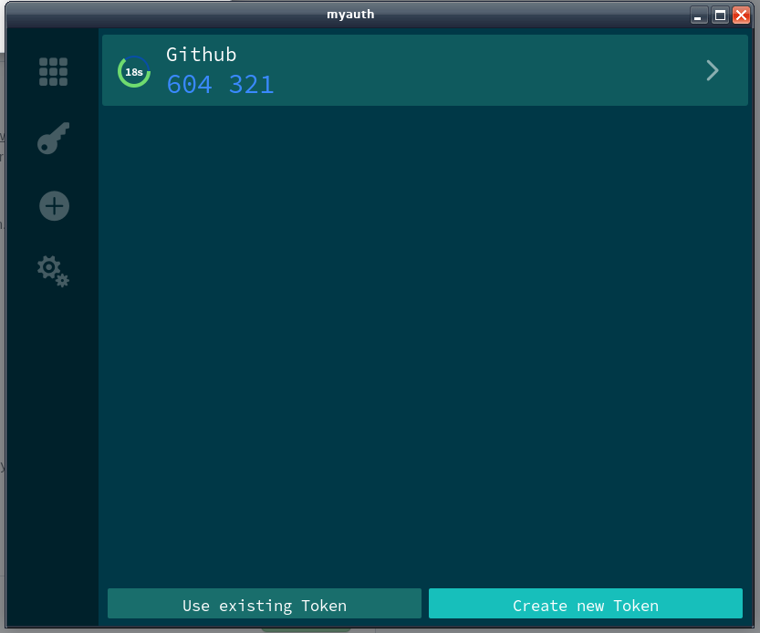
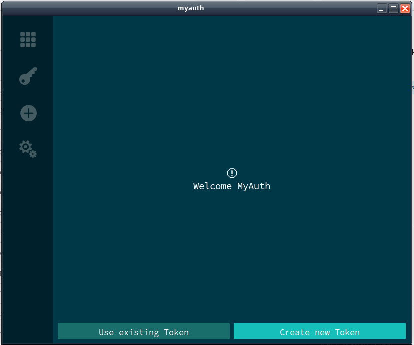
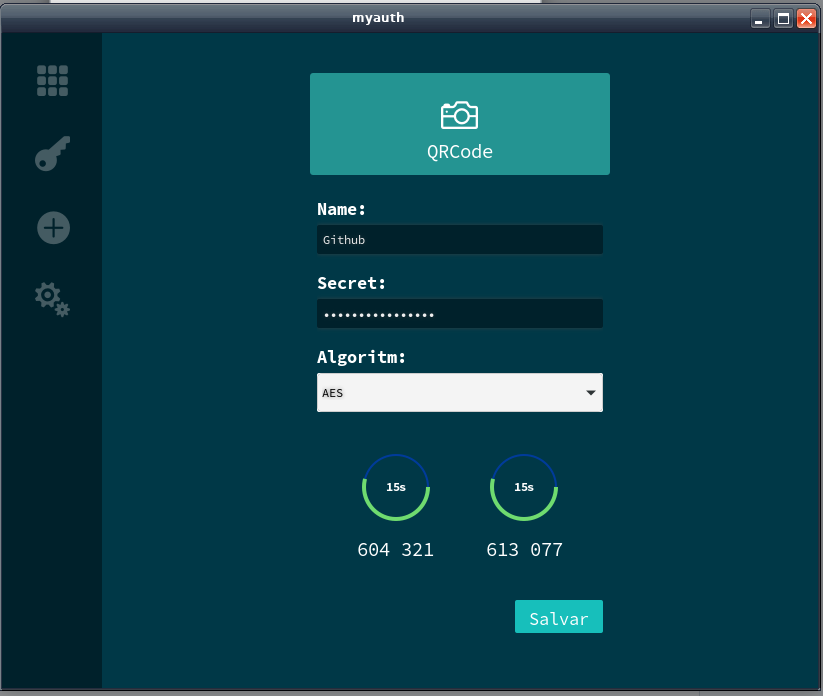
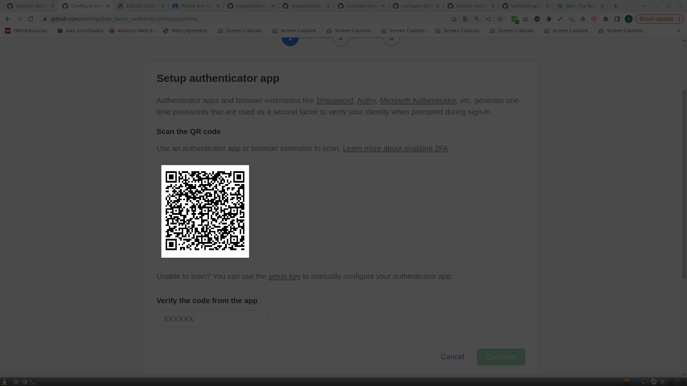
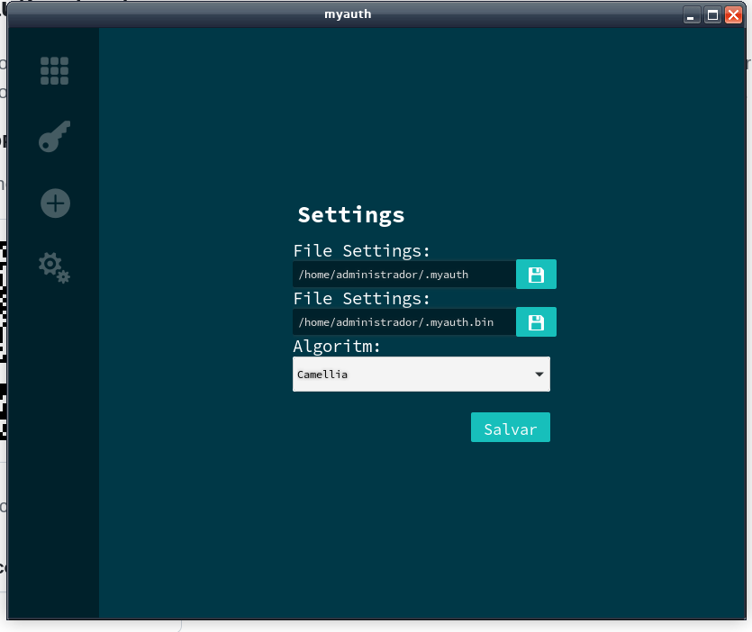

# MyAuth

MyAuth, manager token OTP and HOTP

## About

Tired of using Google Authenticator or Windows Authenticator? Use MyAuth, a stable alternative to authenticate or save a copy of your keys

## Windows

